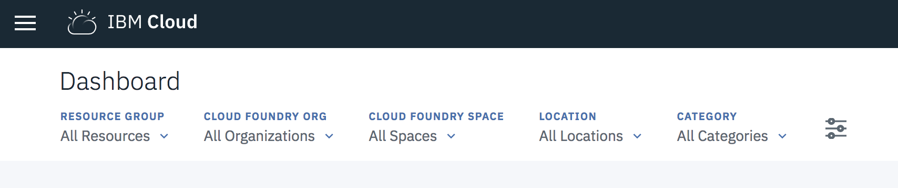
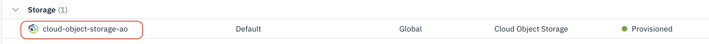
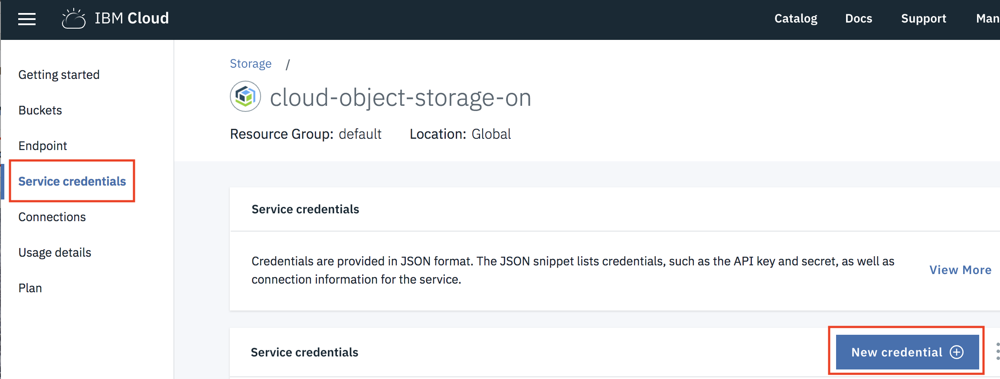
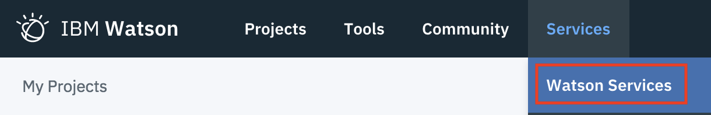
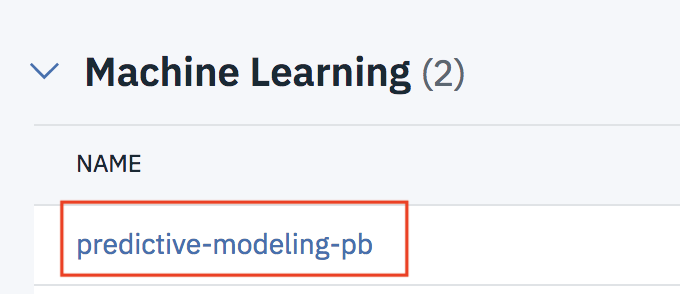

#  Predicting Oil Prices Using an RNN with Watson Studio

## Part 2 - Hyperparameter optimization, model deployment and scoring with Watson Studio

This Watson Studio labs continues working with the RNN developed in  [Part 1](https://github.com/justinmccoy/timeseries-rnn-lab-part1). It contains the steps and code to demonstrate support of deep learning experiments in Watson Machine Learning Service. It illustrates the use of  the  Watson Machine Learning Python API for getting data, experiment definition, hyper parameter optimization, model persistence, model deployment and scoring.

## Setup

**Note:** If you haven't done  the lab in [Part 1](https://github.com/justinmccoy/timeseries-rnn-lab-part1) then follow the following steps in the [setup instructions for Part 1](https://github.com/justinmccoy/timeseries-rnn-lab-part1#setup) before continuing:

   i. Sign up for Watson Studio (if you haven't already)

   ii. Create a Watson Studio Project


### 1. Add Cloud Object Storage credentials for your code

Your code  will need access to Cloud Object Storage in this lab. An instance of Cloud Object Storage  will have been created for you when you created the Watson Studio Project in Part 1.

1.1 Sign in to the [IBM Cloud](https://cloud.ibm.com) with the same credentials you use for Watson Studio. Click on **Storage**



1.2 In the **Storage** section click on your instance of Cloud Object Storage




1.3 Click  on **Service Credentials** and then on **New credential** as shown in the screenshot below:




1.4 Check **Include HMAC Credential** and then click **Add**


1.5 Click on **View credentials** next to the  credential you just added and copy the entire JSON document to a new text file on your Desktop. You'll need this information when running your notebook later in the lab.


### 2. Associate an instance of the Watson Machine Learning service  with your Watson Studio Project

2.1 In a new browser tab go to  [Watson Studio](https://dataplatform.ibm.com), sign in if required, and then  select **Projects->Time Series RNN Demo**


2.2 Click on the **Settings** for your project


2.3 Scroll down to the **Associated services** section. Click on **Add Service**, select **Watson** and then click the **Add** link in the **Machine Learning** tile

2.4 If the **Existing** tab is enabled click on it and then select your existing instance from the drop down. Click **Select** and skip to step 2.6.

2.5 If you don't have an existing Machine Learning instance click on the **New** tab , select the **Lite plan** and then click **Create**. Click on **Confirm** when prompted.

2.6 From the Watson Studio menu (hamburger icon) ) at the top left select **Services->Watson Services**



2.7 Click on the Watson Machine Learning instance you just created



2.8 Select **Service credentials** and then click on **View credentials** for the one set of credentials already there.


2.8 Copy the JSON content to the  same text file you used to save the Cloud Object Storage credentials earlier. You'll need this information when running your notebook later in the lab.


### 3. Create  and run this lab's notebook

3.1 Go back to your Watson Studio tab and select **Projects->Time Series RNN Demo**

3.2 Click on the **Assets** tab


3.2 Scroll down to the *Notebooks* section and click on **New Notebook**

3.3 Name the Notebook *My Time Series RNN Demo Part 2* . Select **From URL** and copy the following URL into the **Notebook URL** field

```
https://raw.githubusercontent.com/ibm-ai-education/timeseries-rnn-lab-part2/master/oilpricernnpart2.ipynb
```

3.4 Click on **Create Notebook**. After a few seconds the notebook should be loaded


3.5 Follow the instructions in the notebook to complete the exercise.
